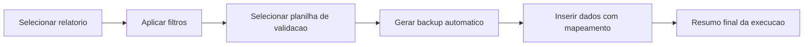

# Atualizador Validacao

Aplicativo desktop em Python criado para reduzir o trabalho manual na rotina de:

1. Gerar relatorio de atendimentos.
2. Filtrar os dados com regras de negocio.
3. Enviar os resultados para outra planilha de validacao.

Com esse projeto, o processo fica mais rapido, seguro e padronizado.

## Download rapido

- Executavel direto: [dist/AtualizadorValidacao.exe](dist/AtualizadorValidacao.exe)
- Pacote zip: [dist/AtualizadorValidacao.zip](dist/AtualizadorValidacao.zip)
- Configuracao do atualizador: [dist/update_config.json](dist/update_config.json)

## Fluxo da automacao



## Funcionalidades

- Interface grafica com CustomTkinter.
- Leitura de arquivos .xls, .xlsx, .xlsm e .csv.
- Filtro por nota maxima.
- Limite de registros por dia e pesquisa.
- Mapeamento de colunas para aba de destino.
- Preservacao de formato da planilha durante insercao.
- Ajuste automatico da tabela do Excel quando necessario.
- Backup automatico antes da escrita.
- Botao Atualizar aplicativo no .exe para baixar a ultima versao publicada na branch main do GitHub.

## Atualizacao automatica no executavel

O botao Atualizar aplicativo funciona no .exe compilado e faz:

1. Consulta ao GitHub para localizar o arquivo mais recente na branch main.
2. Download do novo executavel.
3. Substituicao do .exe atual.
4. Reinicio automatico do aplicativo.

### Configuracao necessaria

O projeto ja vem configurado para o repositorio padrao `gabri/Projeto_Validacao`.
Se o repositorio for diferente, edite [update_config.json](update_config.json):

```json
{
	"repo_owner": "gabri",
	"repo_name": "Projeto_Validacao",
	"branch": "main",
	"asset_path": "dist/AtualizadorValidacao.exe",
	"timeout_seconds": 60
}
```

## Como rodar localmente

### 1. Criar e ativar ambiente virtual (Windows PowerShell)

```powershell
python -m venv .venv
.\.venv\Scripts\Activate.ps1
```

### 2. Instalar dependencias

```powershell
pip install -r requirements.txt
```

### 3. Executar

```powershell
python main.py
```

## Como gerar o executavel

```powershell
pip install -r requirements-dev.txt
pyinstaller --noconfirm --clean --windowed --onefile --name "AtualizadorValidacao" --collect-data customtkinter main.py
```

Saida:

- dist/AtualizadorValidacao.exe

## Estrutura do projeto

- main.py: interface e logica de processamento
- update_config.json: configuracao do botao de atualizacao automatica
- requirements.txt: dependencias de execucao
- requirements-dev.txt: dependencias de desenvolvimento/build
- dist/: executavel para distribuicao

## Publicar no GitHub

Se ainda nao existir repositorio local:

```powershell
git init -b main
git add .
git commit -m "feat: versao inicial do atualizador"
git remote add origin https://github.com/SEU_USUARIO/SEU_REPOSITORIO.git
git push -u origin main
```

## Observacoes

- O .venv e a pasta build ficam fora do versionamento.
- O executavel em [dist/AtualizadorValidacao.exe](dist/AtualizadorValidacao.exe) permanece no projeto para download direto.
- O pacote [dist/AtualizadorValidacao.zip](dist/AtualizadorValidacao.zip) inclui o .exe e o `update_config.json` para facilitar distribuicao.