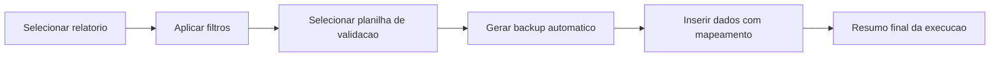

# 🚀 Organizador de Validacoes

Aplicativo desktop em Python para acelerar uma rotina de trabalho que antes era manual:

1. Gerar relatorio de atendimentos.
2. Filtrar registros com regras de negocio.
3. Enviar os dados para uma planilha de validacao.

Resultado: mais velocidade, menos erro humano e processo padronizado. ✅

## 🔗 Repositorio oficial

- Usuario: **3Gb3**
- Projeto: **Organizador_Validacoes**
- Link: https://github.com/3Gb3/Organizador_Validacoes

## 📦 Download rapido

- Executavel: [dist/AtualizadorValidacao.exe](dist/AtualizadorValidacao.exe)
- Pacote completo: [dist/AtualizadorValidacao.zip](dist/AtualizadorValidacao.zip)
- Configuracao do updater: [dist/update_config.json](dist/update_config.json)

## 🧭 Fluxo da automacao



## ✨ Funcionalidades

- Interface grafica com CustomTkinter.
- Leitura de arquivos .xls, .xlsx, .xlsm e .csv.
- Filtro por nota maxima.
- Limite de registros por dia e pesquisa.
- Mapeamento de colunas para aba de destino.
- Preservacao de formato da planilha durante insercao.
- Ajuste automatico da tabela do Excel quando necessario.
- Backup automatico antes da escrita.
- Botao Atualizar aplicativo no executavel.

## 🔄 Atualizacao automatica no executavel

Ao clicar em **Atualizar aplicativo**, o app:

1. Consulta a branch main do GitHub.
2. Baixa a versao mais recente do executavel.
3. Substitui o .exe atual automaticamente.
4. Reinicia o app ja atualizado.

### ⚙️ Configuracao usada

Arquivo: [update_config.json](update_config.json)

```json
{
  "repo_owner": "3Gb3",
  "repo_name": "Organizador_Validacoes",
  "branch": "main",
  "asset_path": "dist/AtualizadorValidacao.exe",
  "timeout_seconds": 60
}
```

## ▶️ Como rodar localmente

### 1. Criar e ativar ambiente virtual (Windows PowerShell)

```powershell
python -m venv .venv
.\.venv\Scripts\Activate.ps1
```

### 2. Instalar dependencias

```powershell
pip install -r requirements.txt
```

### 3. Executar

```powershell
python main.py
```

## 🛠️ Como gerar o executavel

```powershell
pip install -r requirements-dev.txt
pyinstaller --noconfirm --clean --windowed --onefile --name "AtualizadorValidacao" --collect-data customtkinter main.py
```

Saida esperada:

- dist/AtualizadorValidacao.exe

## 📁 Estrutura do projeto

- main.py: interface e logica de processamento
- update_config.json: configuracao do botao de atualizacao
- requirements.txt: dependencias de execucao
- requirements-dev.txt: dependencias de build
- dist/: arquivos para distribuicao

## ☁️ Publicar no GitHub

Se precisar configurar do zero:

```powershell
git init -b main
git add .
git commit -m "feat: versao inicial do organizador"
git remote add origin https://github.com/3Gb3/Organizador_Validacoes.git
git push -u origin main
```

## 📝 Observacoes

- .venv e build ficam fora do versionamento.
- O executavel fica no projeto para download direto.
- O zip inclui o .exe e o update_config.json para facilitar distribuicao.